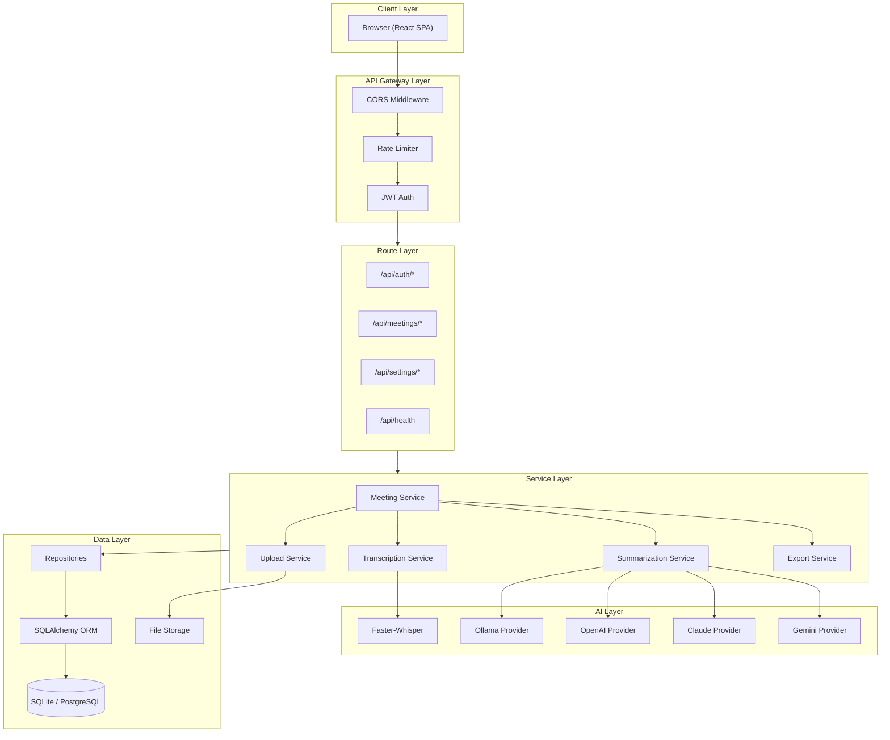
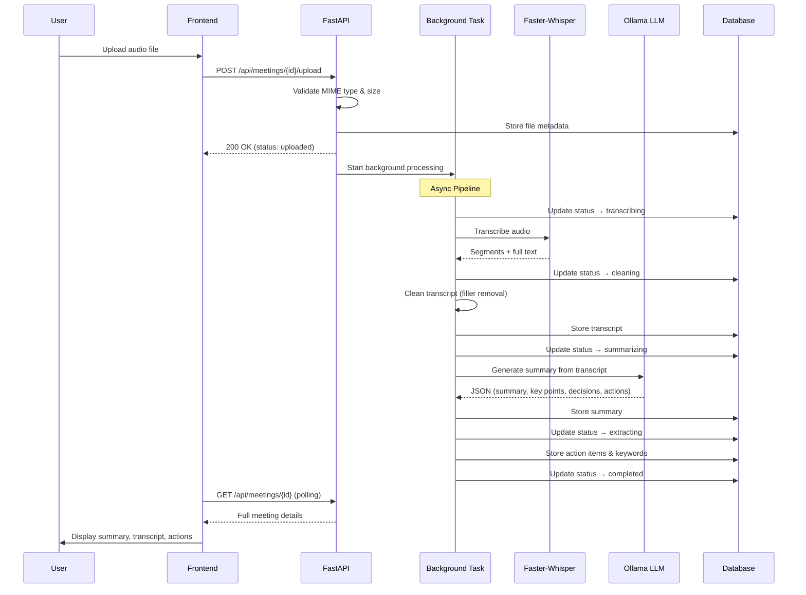
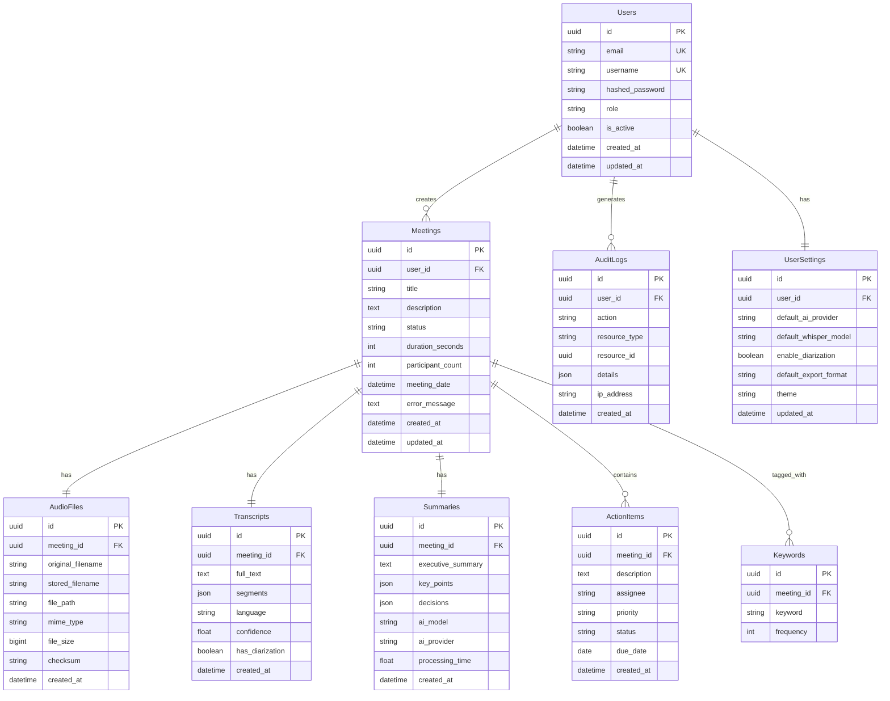
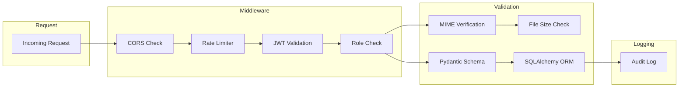

# Architecture Overview

## System Architecture

## Processing Pipeline

## Database Entity Relationship

## Technology Stack

| Layer | Technology | Purpose |
|-------|-----------|---------|
| Frontend | React 19 + TypeScript | SPA with type safety |
| Bundler | Vite 8 | Fast HMR and builds |
| Styling | Vanilla CSS | Custom design system with glassmorphism |
| Icons | Lucide React | Consistent icon set |
| Backend | FastAPI | Async Python REST API |
| ORM | SQLAlchemy 2.0 | Async database operations |
| Auth | JWT (python-jose) + bcrypt | Stateless authentication |
| Transcription | Faster-Whisper | Local, fast, privacy-preserving STT |
| Summarization | Ollama | Local LLM (Gemma 3 / Llama / Mistral) |
| Export | ReportLab + python-docx | PDF and DOCX generation |
| Database | SQLite (dev) / PostgreSQL (prod) | Relational data storage |
| Deployment | Docker + Docker Compose | Container orchestration |
| CI/CD | GitHub Actions | Automated testing and building |

## Security Architecture

### Security measures implemented:
- **Authentication**: JWT access + refresh tokens (HS256)
- **Password Hashing**: bcrypt with strength validation (uppercase, lowercase, digit, special char)
- **Rate Limiting**: slowapi with per-endpoint limits (10/min for auth, 60/min default)
- **File Upload Security**: MIME magic-byte verification, size limits, UUID filenames, SHA-256 checksums
- **SQL Injection**: Prevented via SQLAlchemy ORM (parameterized queries)
- **XSS Prevention**: React auto-escaping + security headers (X-XSS-Protection, X-Content-Type-Options)
- **CORS**: Configured allow-list
- **Audit Logging**: All security-relevant actions logged with user ID and IP
- **RBAC**: Role-based access control ready (user/admin roles)
- **Secret Management**: All secrets in .env, never hardcoded
